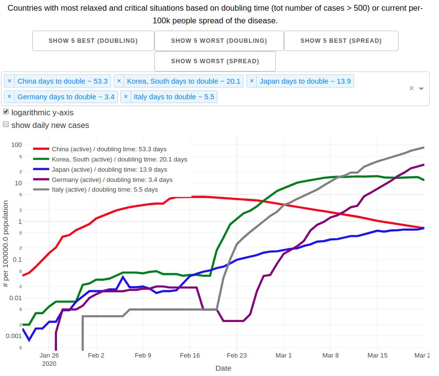

An app to compare covid-19 cases between countries. Based on John-Hopkins data (https://github.com/CSSEGISandData/COVID-19.git).

**An online version is running at https://covid19-country-comparison.herokuapp.com/ and updates the data from the John-Hopkins repository twice a day.**

Calculates doubling time based for active cases. A doubling time of around 10-14 days should be the goal to contain the epidemic. This is only the case if the doubling time is not biased
from changed testing criteria, for example if the number of tests is kept fixed and cannot adjust to the rising cases.

The currently strongest and lowest hit countries in terms of doubling time or overall prevalence per capita can be loaded via a button.

Requirements: pandas, numpy, dash, plotly, gunicorn, countryinfo

Installation: 
git clone, then call "gunicorn app:server", runs in browser

